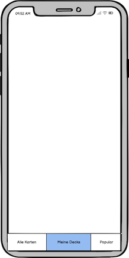
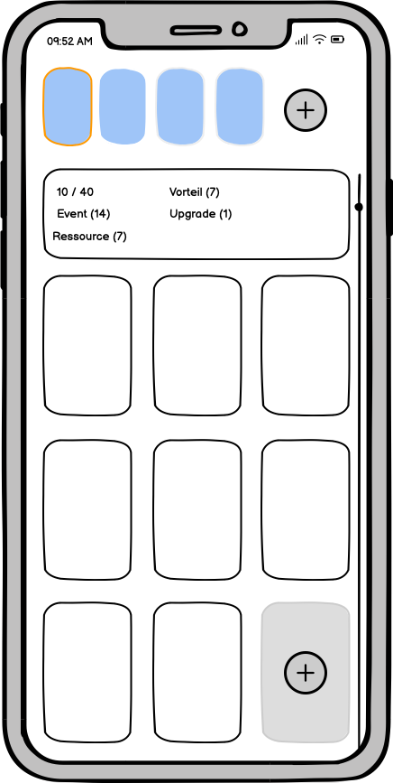
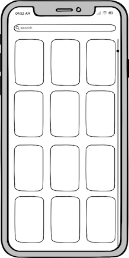

# Marvel Champions Companion

 <!-- -->

## Project Description
The Marvel Champions Companion App is a cross-platform application developed with [Jetpack Compose Multiplatform](https://developer.android.com/jetpack/compose) for Android and iOS. This app provides comprehensive support and resources for the Marvel Champions card game, helping players enhance their gaming experience. The app utilizes the [marvelcdb.com](https://marvelcdb.com) API to provide up-to-date card data and information.

## Features
- Card Database: Browse an extensive database of Marvel Champions game cards, updated through the [marvelcdb.com](https://marvelcdb.com/api/) API.
- Decks and Strategy: Create decks, share them with others, and find strategy tips.
- Game Guide: Get rules, tips, and instructions for Marvel Champions.
- Community: Connect with other Marvel Champions players and share your experiences.

## Mockups

## Installation
The app can be installed on Android devices via the Google Play Store and on iOS devices via the Apple App Store. Alternatively, you can download and manually install the app from this repository.

## Usage
1. Launch the app on your device.
2. Sign in or create an account to access all features.
3. Utilize the various app functions to optimize your Marvel Champions gaming experience.

## Contributors
We welcome contributions from developers and Marvel Champions enthusiasts. 
If you'd like to contribute to the development of the app, follow the guidelines in our [Contributing Guide](CONTRIBUTING.md).-->

## License
This project is licensed under the [GPL License](LICENSE.txt).

## Disclaimer
This project is not affiliated with or endorsed by Marvel Champions or its respective owners. Marvel Champions is a registered trademark of its respective owners. This project is non-profit and created for the benefit of the Marvel Champions community.

## Author
This project is developed by [Alexander Schacher].

Thank you for using the Marvel Champions Companion App!